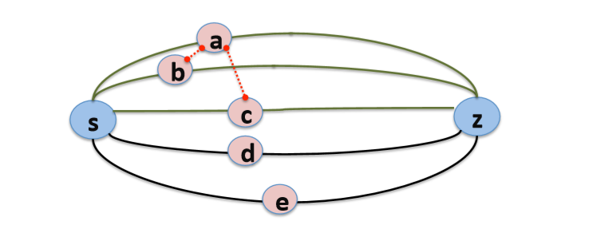
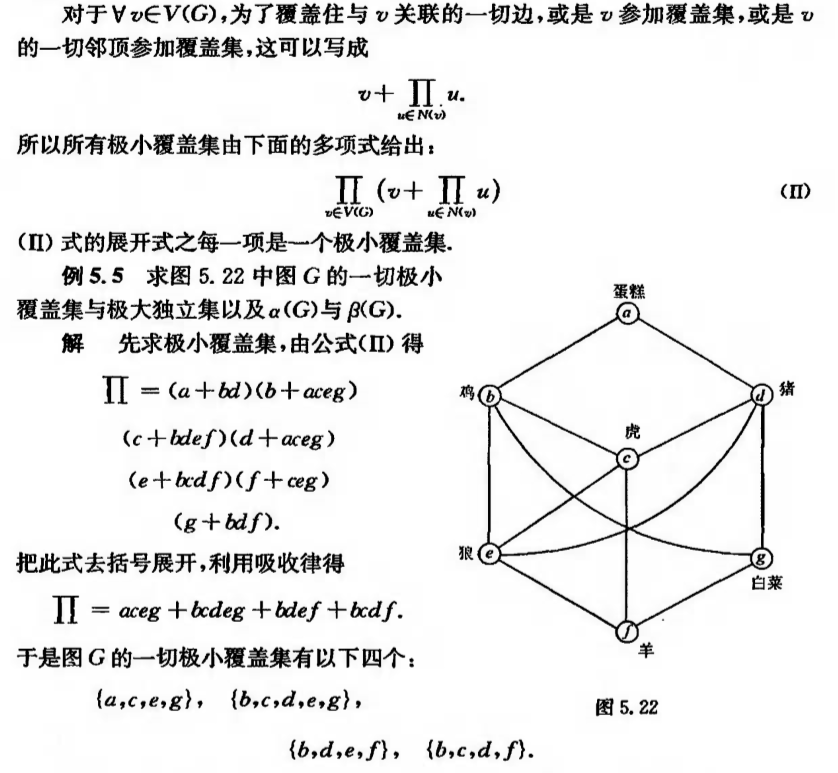

# iPath算法

[TOC]

## 拜占庭容错通信

## 最优可靠径通信路径算法(iPath)

### 模型简化

俩跳网络(2-Hop network)，可自然推广到多跳网络。demo以俩跳为例。



### 算法流程

#### 符号说明

P：全部顶点(s和z之间只有一个中继点，因此每个顶点也表示一个路径)

G：冲突图(conflict graph)中的顶点

O：P - G, i.e.不在冲突图中出现的其它顶点

$$\delta$$：G的最小覆盖集的顶点数

S：$$S\subseteq G$$需要满足$$|S|\le2\delta$$并且S至少包括$$\delta$$个faults，这个S的构建方法出现在reference paper 8中

C：$$C=G-S$$，C满足的性质是$$\gamma^C=\delta$$

$$C^*$$：$$C^*\subseteq C$$，且满足$$|C^*|+|O|=2(f-\delta)+1$$

#### 简单证明

​	按上面的符号，有如下公式：
$$
\begin{aligned}
|C|+|O| =& |G|-|S|+|P|-|G|\\=&|P|-|S|\\\ge&|P|-2\delta\\\ge&2f+1-2\delta\\=&2(f-\delta)+1
\end{aligned}
$$
​	由于S中至少包括$$\delta$$个faults，从而$$C\cup O=P-S$$最多含有$$f-\delta$$个faults，z收到$$2(f-\delta)+1$$个massage，只需要进行大多数投票就可以得出正确的信息。

​	且Lemma.2 证明了$$2(f-\delta)+1$$是下界，于是只需要选择C的子集$$C^*$$就可以了。

#### 算法实现

下面按步说明算法的实现：

1. 创建数据结构 P、G、O
2. 求出G的最小覆盖集$$V_{min}$$，和$$\delta $$
3. 在G中，对$$V_{min}$$和$$G-V_{min}$$做最大匹配，把$$G-V_{min}$$中被匹配的点的集合记作$$V_1$$
4. $$S=V_1\cup V_{min}$$
5. 计算C=G-S
6. 找出$$C^*$$,返回$$C^*\cup O$$

### 简单测试

​	我编了三个简单的测试，大概都只有10+个顶点，因为这个算法求解过程需要计算最小点覆盖和最大匹配问题，都是NP(C)问题，算法复杂度比较大，不知道大测试样例下会是什么样子。

```matlab
% test1
% G_V_num = 7;
% G_O_num = 4;
% G_E = [0,1,1,0,0,0,0;1,0,1,1,1,0,0;1,1,0,0,0,0,0;0,1,0,0,0,1,0;0,1,0,0,0,0,1;0,0,0,1,0,0,1;0,0,0,0,1,1,0];
% test2
% G_V_num = 7;
% G_O_num = 4;
% G_E = [0,0,1,0,0,0,0;0,0,1,0,0,0,0;1,1,0,1,1,0,0;0,0,1,0,0,0,0;0,0,1,0,0,1,1;0,0,0,0,1,0,1;0,0,0,0,1,1,0];
% test3
G_V_num = 8;
G_O_num = 3;
G_E = [0,1,1,0,0,0,0,0;1,0,1,1,1,1,0,0;1,1,0,1,0,0,0,0;...
    0,1,1,0,0,1,0,0;0,1,0,0,0,1,0,0;0,1,0,1,1,0,1,1;...
    0,0,0,0,0,1,0,0;0,0,0,0,0,1,0,0];
```

​	test1是论文里面的样例。

​	简单解释下，G_V_num是conflict graph的顶点个数，G_O_num是没有冲突的路径数目。G_E是冲突图的邻接矩阵，索引从1开始，要求G_E是对称矩阵。

## 使用说明

​	整个程序由一个脚本文件和一个函数文件组成，程序的主流程在脚本文件"main.m"中实现，其中的最大匹配算法在"max_matching.m"中实现。

### 添加测试样例

​	你可能需要修改三个值：把G_V_num改成你构造的冲突图的顶点数目，把G_O_num改成你构造的不在冲突图里的其它顶点的数目，把G_E修改成你构造的冲突图的邻接矩阵(要求：1表示有边，0表示没有边；G_E必须是对称矩阵)。

​	把这三个值修改好，就可以直接运行查看结果了。如果还有问题，你可以先看一下test1-test3和运行结果的对应关系。

### 如何计算最小覆盖集

​	计算普通图的最小覆盖集是个npc问题，没有很好的办法，只能暴力搜索。网上有相应的启发式搜索的算法，但是实现起来比较复杂，这里我自己设计了一个指数级的搜索算法。

​	**首先**，给冲突图的每个顶点一个编号，编号是2的方幂。如，冲突图中的第i的顶点的编号为$$2^{i-1}$$。

​	**其次**，对于冲突图的每个顶点，找到它所有的邻点，并求出所有编号或运算后的结果。如：顶点i的邻点编号是1和2，则这个结果就是1|2=01|10=11=3。把这个结果和该顶点的编号放在一个数组里。如[i,3]。

​	**然后**进行G_V_num次迭代，每次迭代都取出一个顶点和该顶点邻边或运算的结果的数组，用这个数组作为多项式的一个项，如[i,3]作为(i+3)，用这个项去乘以前面的所有的项(假设初始时前面的项是1)。这样，当迭代结束，就会得到一个元素个数为$$2^n$$的数组(如果在过程中进行合并同类项的处理可能会更好些)。

​	**最后**，把这$$2^n$$个元素遍历一遍，找出其中含1位数最少的元素，这个元素对应的就是最小顶点覆盖子集。其每个含1的位，表示对应的这个位在最小覆盖子集中。在程序中，这个最小覆盖集的变量名是V_min_set。

​	数学原理如下：

​	

​	王树禾 图论 第2版 第五章：着色理论 5.5独立集 链接：https://pan.baidu.com/s/1LOsmEzHLgZvaS0r8P2dOsQ 提取码：crn0 

​	**注意**：这里的或运算相当于吸收律。

### 如何计算最大匹配

​	按照上一步产生的最小覆盖子集，生成一个二分图，i.e.把俩个最小覆盖子集中顶点之间的边删掉。

​	对于这个二分图，进行最大匹配。

​	这里用到的基于寻找**增广路径**的最大匹配算法。本质上是一个深度优先搜索。

​	对于最小覆盖子集中的每个顶点，寻找从这个顶点开始的增广路径。在寻找增广路径的过程中，如果可以找到，就同时把增广路径上的顶点进行许配。

​	首先定义**访问**：在对最小覆盖集中的一个顶点进行寻找增广路径的过程中，有没有查询过某个顶点。

​	定义**许配**：在整个最大匹配的算法中，用一个许配数组记录当前哪些顶点之间被相互许配了。

​	寻找增广路径的过程比较简单，递归的终止条件是找到一个没有被许配并且没有被访问过的顶点，就返回true；找到一个顶点**其所有的邻点**都被访问过或者有些没被访问过，但是已经在之前的匹配中被许配给当前顶点了。

### 如何可视化结果

​	主要的类：

​	[Graph](https://ww2.mathworks.cn/help/matlab/ref/graph.html)

​	[GraphPlot](https://ww2.mathworks.cn/help/matlab/ref/matlab.graphics.chart.primitive.graphplot.html)

​	主要的函数：

​	[highlight](https://ww2.mathworks.cn/help/matlab/ref/matlab.graphics.chart.primitive.graphplot.highlight.html)

​	[addNode](https://ww2.mathworks.cn/help/matlab/ref/graph.addnode.html)

​	

### 显示故障点和保存图片

​	**故障点集**(fault_set)中必然包括所有最小覆盖集中的顶点，同时最多不能达到所有顶点的一半。

​	在程序中，我设置为每次取f个故障点，你可以在这里修改